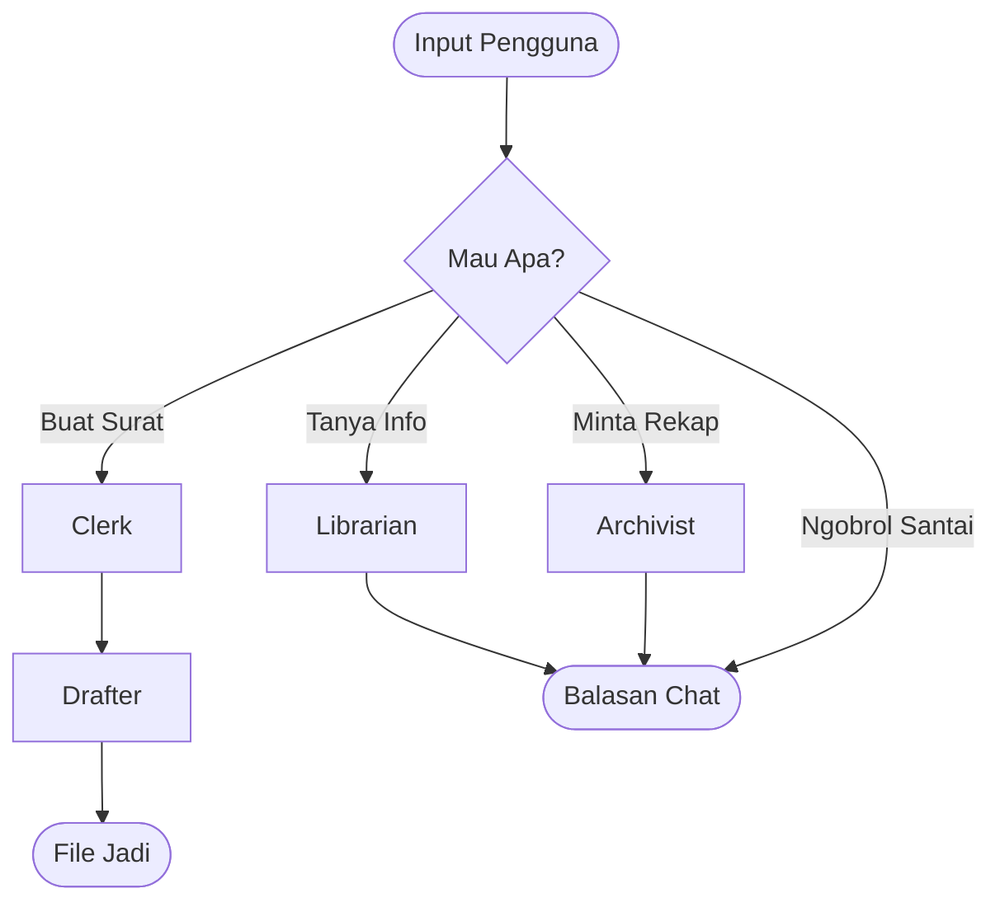

# The Secretary Swarm (Mesin Bot SiAP)

**The Secretary Swarm** adalah sistem kecerdasan buatan (AI) canggih yang dirancang untuk menjadi "otak" dari ekosistem **SiAP** (Sistem Informasi & Administrasi Pesantren). Sistem ini bertugas mengotomatisasi pekerjaan administratif Divisi Multimedia.

Dibangun menggunakan **Python**, **LangGraph**, dan **Google Gemini 1.5 Flash**, proyek ini menjalankan sekumpulan "agen" AI yang bekerja sama layaknya tim sekretaris digital. Mereka bisa membuat surat resmi, menjawab pertanyaan tentang aturan, hingga merekap percakapan.

---

## 🤖 Pasukan Agen (The Swarm)

Sistem ini membagi tugas kepada agen-agen spesialis:

### 1. The Listener (Si Pendengar)
Gerbang utama dan pusat kecerdasan.
- **Tugas**: Menganalisis apa yang diinginkan pengguna.
- **Kemampuan**: Bisa membedakan apakah pengguna ingin **Ngobrol**, **Membuat Surat**, **Bertanya Aturan (RAG)**, atau **Minta Rekap**.

### 2. The Librarian (Si Pustakawan)
Penjaga ilmu dan dokumen.
- **Tugas**: Menjawab pertanyaan berdasarkan dokumen yang tersimpan (SOP, Pedoman, Aturan).
- **Teknologi**: Menggunakan **Supabase** (Database Vektor) dan **Google GenAI** untuk mencari jawaban yang akurat.

### 3. The Clerk (Si Juru Tulis)
Manajer template surat.
- **Tugas**: Menemukan template `.docx` yang tepat untuk tugas administrasi (misal: *Surat Undangan*, *Notulensi Rapat*).

### 4. The Drafter (Si Pembuat Dokumen)
Eksekutor pembuatan file.
- **Tugas**: Mengisi template surat dengan data yang sudah diolah oleh The Listener.
- **Teknologi**: Menggunakan mesin otomatisasi untuk menghasilkan file Word yang rapi dan siap cetak.

### 5. The Archivist (Si Arsiparis)
Pencatat sejarah.
- **Tugas**: Melihat kembali log percakapan dan memberikan ringkasan (rekap) interaksi.

---

## 🏗 Cara Kerja Sistem

Sistem ini menggunakan alur kerja canggih berbasis **LangGraph**:



---

## � Cara Install & Menjalankan

### 1. Download Project
```bash
git clone <repository_url>
cd The_Secretary_Swarm
```

### 2. Install Library Pendukung
Pastikan Python sudah terinstall, lalu jalankan:
```bash
pip install -r requirements.txt
```

### 3. Atur Kunci Rahasia (.env)
Buat file bernama `.env` di folder utama, lalu isi dengan kunci API Anda:

```env
# Otak AI (Google Gemini)
GOOGLE_API_KEY=masukkan_api_key_gemini

# Telegram Bot
TELEGRAM_BOT_TOKEN=masukkan_token_bot_telegram

# Database (Supabase)
SUPABASE_URL=url_supabase_anda
SUPABASE_KEY=key_supabase_anda
```

### 4. Menjalankan Bot (Di Komputer Sendiri)
Untuk mengaktifkan bot agar online:
```bash
python main.py
```

---

## 🧠 Cara Mengisi "Otak" Bot (Input Knowledge)

Agar **Si Pustakawan (Librarian)** pintar, kita perlu memberinya bahan bacaan (SOP, Aturan, Diagram). Kami menyediakan alat khusus untuk ini.

### 1. Siapkan Dokumennya
Anda bisa menyiapkan dokumen dalam format:
*   **PDF / DOCX / TXT**: Untuk teks aturan atau pedoman.
*   **Gambar (PNG/JPG)**: Untuk bagan alur (flowchart) atau diagram SOP. AI akan otomatis "melihat" gambar dan mengubahnya menjadi teks penjelasan.

### 2. Jalankan Script Admin
Buka terminal dan ketik:
```bash
python scripts/admin_add_knowledge.py
```

### 3. Masukkan Data
Setelah script berjalan, Anda akan diminta input:

> **Masukkan Teks / Path File:**

Anda punya 3 pilihan cara input:

*   **Cara A (Drag & Drop File)**: Tarik file (PDF/Gambar/Docx) dari folder langsung ke jendela terminal. Tekan Enter. Script akan otomatis membaca, mengupload, dan menyimpannya ke otak bot.
*   **Cara B (Ketik Path Manual)**: Ketik lokasi file, contoh: `C:\Dokumen\SOP_Keuangan.pdf`.
*   **Cara C (Ketik Teks Langsung)**: Anda bisa langsung mengetik atau paste teks pendek untuk disimpan sebagai pengetahuan instan.

### 4. Selesai!
Ketik `EXIT` untuk keluar dari program.
Bot sekarang sudah lebih pintar dan bisa menjawab pertanyaan terkait dokumen yang baru Anda upload!

---

## 📂 Struktur Folder Proyek

```
├── main.py              # Pintu masuk utama (untuk run bot)
├── requirements.txt     # Daftar library yang dibutuhkan
├── src/
│   ├── agents/          # Otak masing-masing agen (Listener, Librarian, dll)
│   ├── core/            # Pengaturan dasar & koneksi database
│   ├── interfaces/      # Penghubung ke Telegram
│   ├── workflow.py      # Peta alur kerja agen
│   └── nodes.py         # Definisi tugas tiap agen
├── templates/           # Tempat menyimpan template surat (.docx)
└── scripts/             # Alat bantu admin (Upload ilmu, Perbaikan DB, dll)
```
